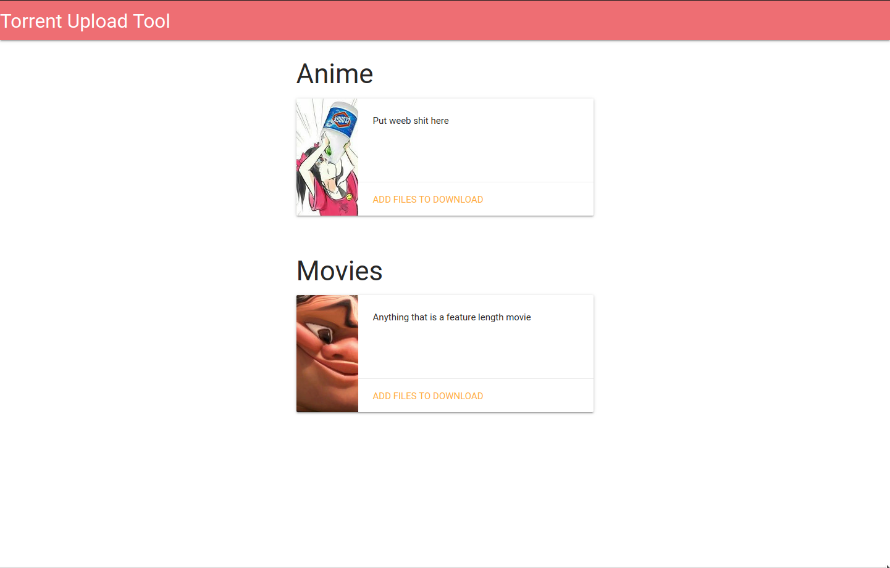
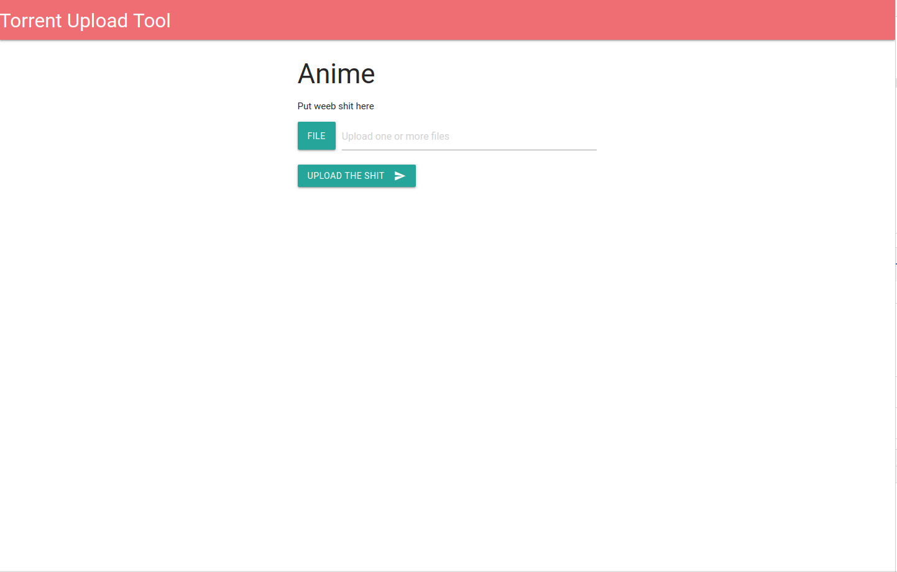

# Torrent Uploader

A program that will allow for a user to upload torrents to it via a web interface. Could be used for someone running a media server to allow their users to add shows that they want without having full access to the torrent software on the server. 

To make this site I used a node.js backend with handlebars and bootstrap for the frontend. I decided to go with server-side rendering since it was easier to implement in a short period of time for a project this small. Below are some pictures of the actual site in action. 

IMPORTANT NOTE: I made this project for fun, I'm not this sarcastic normally. Please hire me :weary:

## Main page
This page is to allow the user to navigate to the other pages to upload the torrents.

## Upload page
This page is dynamically loaded from a config file that provides info about what kind of catagories that they want for their site.

